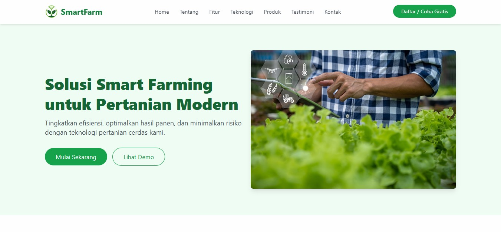

# Project Smartfarm Frontend

Selamat datang di repositori frontend untuk proyek Smartfarm! Proyek ini bertujuan untuk menyediakan antarmuka pengguna yang intuitif dan responsif untuk mengelola dan memantau sistem pertanian cerdas.



## Tentang Proyek

Proyek Smartfarm ini dibangun menggunakan Vite, React, TypeScript, dan Tailwind CSS. Ini adalah aplikasi frontend yang terhubung dengan backend untuk mengelola data terkait pertanian, seperti sensor, perangkat, jadwal irigasi, dan informasi tenant/pengguna. Aplikasi ini dirancang untuk administrator dan pengguna akhir untuk memantau dan mengontrol operasi pertanian.

### Fitur Utama

-   **Dashboard Admin:** Tinjauan komprehensif untuk administrator, termasuk manajemen pengguna, tenant, paket langganan, dan langganan.
-   **Manajemen Pengguna:** Menambah, memperbarui, dan menghapus pengguna.
-   **Manajemen Tenant:** Mengelola informasi tenant dan statusnya.
-   **Manajemen Langganan:** Mengatur paket langganan dan status langganan.
-   **Autentikasi Aman:** Menggunakan `authStore` dengan JWT untuk manajemen sesi yang aman.
-   **Antarmuka Responsif:** Dibangun dengan Tailwind CSS untuk pengalaman pengguna yang mulus di berbagai perangkat.

### Teknologi yang Digunakan

-   **Framework:** React 18
-   **Build Tool:** Vite 4
-   **Bahasa:** TypeScript
-   **Styling:** Tailwind CSS 3 (dengan plugin `tailwindcss forms`)
-   **Routing:** React Router 6
-   **State Management:** Zustand
-   **HTTP Client:** Axios
-   **Authentikasi:** JWT-decode
-   **Testing:** Vitest
-   **Linting & Formatting:** ESLint, Prettier
-   **Version Control Hooks:** Husky, commitlint (dengan Conventional Commits)

## Instalasi dan Penggunaan

Untuk menjalankan proyek ini secara lokal, ikuti langkah-langkah berikut:

### Prasyarat

Pastikan Anda memiliki Node.js (disarankan versi LTS) dan Yarn terinstal di sistem Anda.

### Langkah-langkah

1.  **Clone repositori:**
    ```bash
    git clone [URL_REPOSITORI_ANDA]
    cd smartfarm-fe
    ```

2.  **Instal dependensi:**
    ```bash
    yarn install
    ```

3.  **Jalankan aplikasi dalam mode pengembangan:**
    ```bash
    yarn dev
    ```
    Aplikasi akan berjalan di `http://localhost:5173` (atau port lain yang tersedia).

4.  **Jalankan tes:**
    ```bash
    yarn test
    ```

## Kontribusi

Kami menerima kontribusi! Silakan fork repositori, buat branch fitur Anda, dan kirimkan pull request. Pastikan untuk mengikuti pedoman commit dan gaya kode yang ada.

## Lisensi

Proyek ini dilisensikan di bawah [LICENSE_ANDA].
